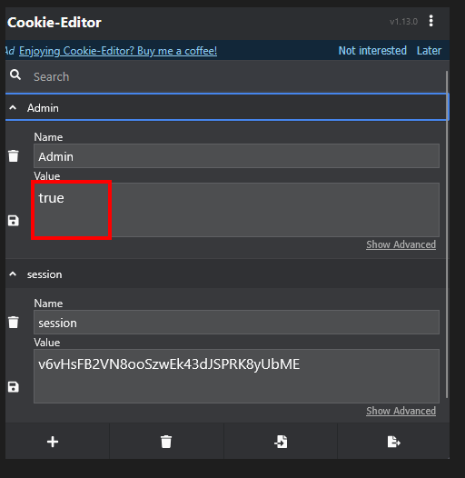

# Lab: User Role Controlled by Request Parameter

This walkthrough covers the PortSwigger Web Security Academy lab: **User role controlled by request parameter**.

**Lab link:** https://portswigger.net/web-security/access-control/lab-user-role-controlled-by-request-parameter  
**Difficulty:** Apprentice  


## Known Information

From the lab description, we know the following:

- The application contains an admin panel at `/admin`.
- Administrators are identified using a cookie.
- We have valid user credentials: `wiener:peter`.
- The goal is to access the admin panel and delete the user `carlos`.

## Steps

### Analysis

As usual, I start by analyzing the web application to understand how it works.

The general shop pages do not reveal anything interesting, so I log in using the provided credentials:


```text
wiener:peter
```


### Checking the cookies

After logging in, I inspect the cookies used by the application.

To do this easily, I use a browser extension such as **Cookie-Editor**, which allows me to view and modify cookies directly from the browser.

The application sets two cookies:

- `session`
- `Admin`

The `session` cookie identifies my current login session, while the `Admin` cookie looks like it may be used to decide whether my account has administrator privileges.

Because the lab description says that administrators are identified by a cookie, I focus on the `Admin` cookie and test whether changing its value affects my access.


To test the access control, I modify the value to:

```
Admin=true
```

f the application trusts this cookie without verifying the user’s role on the server side, changing the value to `true` may allow access to the admin panel.



After changing the `Admin` cookie value from `false` to `true` and reloading the page, the application exposes the **admin panel**. From there, I can access the user management functionality, delete the user `carlos`, and complete the lab.


