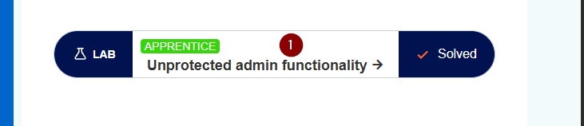
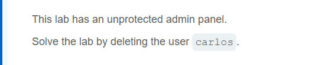
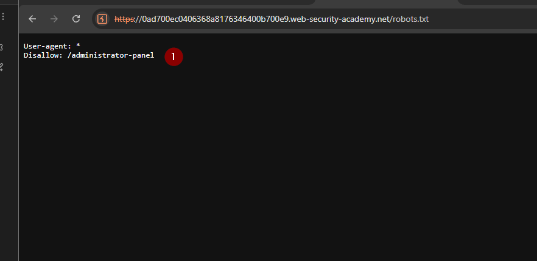

# Write-up: Unprotected admin functionality  PortSwigger Academy





I will walk through the PortSwigger Web Security Academy lab **Unprotected admin functionality**.

This lab focuses on a common access control issue where an admin panel is exposed without proper protection. The goal is to identify the hidden admin functionality and understand why sensitive areas must never be left accessible without authorization checks.

**Learning path:** Server-side topics → Access control vulnerabilities  
**Lab link:** https://portswigger.net/web-security/access-control/lab-unprotected-admin-functionality  
**Difficulty:** Apprentice

## Lab description



## Steps

The first thing I do is quickly explore the application to understand what kind of website I am dealing with. In this lab, the target is a simple shop website.

During the initial enumeration phase, one useful file to check is `robots.txt`.

This file is normally used to give instructions to search engine crawlers about which parts of the website should or should not be indexed. However, from a security testing point of view, it can sometimes reveal interesting paths that the developer did not want search engines to visit.

The important point is that `robots.txt` does not provide real protection. It only gives instructions to crawlers. Anyone can open it in the browser because it is just a plain text file.

So, as a tester, checking this file can help discover hidden or sensitive locations, such as admin panels or private directories.

There are different ways to check whether this file exists, but the simplest method is manual browsing.

### Manual browsing

I can try to access the file directly in the browser by visiting:

```http
/robots.txt
```





### Checking `robots.txt` with curl

Instead of opening the file in the browser, I can also check it directly from the terminal using `curl`:


```bash
curl https://0a8f00f704cb9ca9c08906980091002a.web-security-academy.net/robots.txt


